<h1 align="center">Salut 👋, moi c'est Alexis</h1>
<h3 align="center">Développeur full stack créatif avec un goût prononcé pour l'innovation et la performance</h3>

  <a href="https://dev-alexismartin.fr" target="_blank">🌐 Portfolio</a> •
  <a href="https://www.linkedin.com/in/alexis-martin-556990144/" target="_blank">LinkedIn</a> •
  <a href="mailto:alexis.martin45@orange.fr">Email</a>

---

## À propos

Développeur full-stack avec plus de 6 ans d'expérience dans la conception d'applications web performantes et innovantes.

- 💻 Expertise en **développement front-end** (React, Angular, JavaScript, Bootstrap, Tailwind) et **back-end** (Node.js, Express JS, PHP).
- 🐳 Passionné par les aspects **DevOps**, j'utilise Docker pour la gestion de mes environnements et l’automatisation de mes déploiements.
  
Mon objectif : **créer des applications web intuitives, évolutives et robustes**, en intégrant des principes de design et de performance.

---

## ⚙️ Stack actuelle

---

## 📈 Statistiques GitHub

---

Merci pour la visite 🙌

